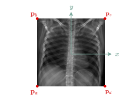
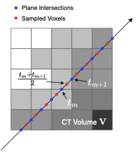
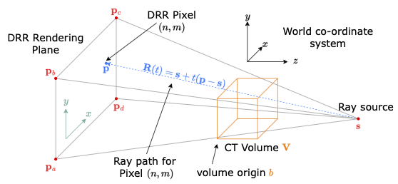

# DRR-RATE

<p align="center">
  &nbsp;&nbsp;
  <a href="https://huggingface.co/datasets/farrell236/DRR-RATE"></a>
  &nbsp;&nbsp;
  <a href=""></a>
  &nbsp;&nbsp;
</p>

The DRR-RATE dataset is built upon the recently released [CT-RATE](https://huggingface.co/datasets/ibrahimhamamci/CT-RATE)<sup>[1]</sup> dataset, which comprises 25,692 non-contrast chest CT volumes from 21,304 unique patients. Each study is accompanied by a corresponding radiology text report and binary labels for 18 pathology classes. The dataset has been expanded to 50,188 volumes through the use of various reconstruction techniques from raw DICOM imaging data. The data is already anonymized, ensuring compliance with the Health Insurance Portability and Accountability Act (HIPAA), and the requirement for informed consent was waived. CT-RATE is published under the Creative Commons Attribution-NonCommercial-ShareAlike (CC-BY-NC-SA) license. In accordance with this license, DRR-RATE is licensed under the same terms.

<p align="center">
  &nbsp;&nbsp;
  
  &nbsp;&nbsp;
  
  &nbsp;&nbsp;
  
  &nbsp;&nbsp;
</p>

### `./getDRRSiddonJacobsRayTracing`

<p align="center">
  &nbsp;&nbsp;
  
  &nbsp;&nbsp;
</p>

To generate DRRs of the CT-RATE dataset, the binary tool `./getDRRSiddonJacobsRayTracing`<sup>[2,3]</sup> was utilized. Most parameters were kept at their default settings, with the exception of adjusting the volume by 300 mm along the y-axis to enhance the field of view. A threshold cutoff was also set at -100 Hounsfield units (HU). To create lateral view images, the volume was rotated 90 degrees counterclockwise around the z-axis. 

```shell
user@machine:~$ ./getDRRSiddonJacobsRayTracing input_volume.nii.gz \
    -o output_drr.png \
    -threshold -100 \
    -t 0 300 0 \
    -rz -90  # if LATERAL view
```

### References

```text
[1] I. E. Hamamci, S. Er, F. Almas, A. G. Simsek, S. N. Esirgun, I. Dogan, M. F. Dasdelen,
    B. Wittmann, E. Simsar, M. Simsar, et al., “A foundation model utilizing chest ct volumes
    and radiology reports for supervised-level zero-shot detection of abnormalities,” arXiv 
    preprint arXiv:2403.17834, 2024.

[2] J. Wu, “Itk-based implementation of two-projection 2d/3d registration method with an 
    application in patient setup for external beam radiotherapy,” Virginia Commonwealth 
    University, 12 2010.

[3] B. Hou, “farrell236/midas-journal-784.”
    https://github.com/farrell236/midas-journal-784, 2019.
```

### Citation

```text

```